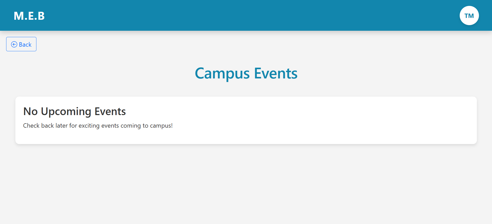
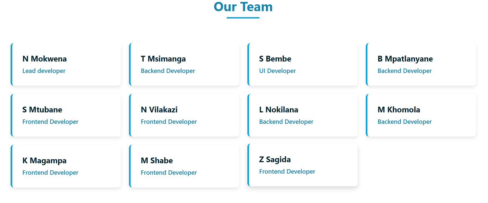

#  MEB-HUB: Campus Navigation & Information Platform

A comprehensive web application designed to help first-year students at Tshwane University of Technology navigate campus life with ease. MEB-HUB provides essential information including bus schedules, campus event calendars, and interactive campus maps - all in one convenient platform.

## 🎯 Problem Statement

First-year students often struggle with:
- Finding reliable bus schedule information
- Staying updated on campus events
- Navigating the campus effectively
- Accessing centralized student resources
- admin panel to manage all the resources

MEB-HUB solves these challenges by providing a user-friendly, centralized platform for all campus-related information.

---

## ✨ Features

### 🚌 Bus Schedule Management
- bus schedule information
- Easy-to-navigate timetable interface

### 📅 Campus Events
- Browse upcoming campus events
- Event details with dates and locations
- Stay informed about important campus activities

### 🗺️ Interactive Campus Maps
- Google Maps integration for campus navigation
- Building locator with detailed descriptions
- Find lecture halls, facilities, and amenities
- Accessibility information for campus locations

### 👤 Student Portal
- User authentication and secure login
- Personalized student dashboard
- Profile management

### 🔧 Admin Panel
- intergrated simple admin interface
- Manage bus schedules, events and routes
- Add, edit, and delete campus events
- Update campus locations and maps
- User management
- Real-time data management

---

## 🛠️ Tech Stack

**Backend:**
- Python 3.x
- Django 4.x
- Postgresql Database

**Frontend:**
- HTML5
- CSS3
- JavaScript

**Tools:**
- Git & GitHub
- VS Code

---

## 📸 Screenshots

### 🏠 Home Page

*Main dashboard with quick access to campus resources*

### 🚌 Bus Schedule

*Real-time bus schedule information for student commuters*

### 📅 Campus Events

*Stay updated with campus activities and important dates*

### 🗺️ Campus Map
*Interactive Google Maps integration - requires API key configuration for demonstration*

### ⚙️ Custom Admin Dashboard

*Custom-built administrative interface for managing campus data and user accounts. Features include bus schedule management, event creation and updates, campus location and user management settings. Designed with an intuitive UI for efficient content management.*

### 👥 Development Team

*Meet the team behind MEB-HUB: A collaborative effort by Computer Science students at Tshwane University of Technology. This project showcases our combined skills in full-stack development, database design, and user experience.*

---

## 🚀 Installation & Setup

### Prerequisites
- Python 3.8 or higher
- pip (Python package manager)
- Git

### Local Development Setup

1. **Clone the repository**
```bash
git clone https://github.com/Nhlamulo-Mokwena/MEB-HUB-PROJECT.git
cd MEB-HUB-PROJECT
```

2. **Create a virtual environment**
```bash
python -m venv venv
source venv/bin/activate  # On Windows: venv\Scripts\activate
```

3. **Install dependencies**
```bash
pip install -r requirements.txt
```

4. **Run migrations**
```bash
python manage.py makemigrations
python manage.py migrate
```

5. **Create a superuser (admin)**
```bash
python manage.py createsuperuser
```

6. **Run the development server**
```bash
python manage.py runserver
```

7. **Access the application**
- Open your browser and go to: `http://127.0.0.1:8000/`
- Admin panel: `http://127.0.0.1:8000/admin/`

---

## 📁 Project Structure

```
MEB-HUB-PROJECT/
│
├── meb_hub/              # Main Django project settings
├── students/             # Student portal app
├── events/               # Events management app
├── maps/                 # Campus maps app
├── buses/                # Bus schedule app
├── static/               # CSS, JS, images
├── templates/            # HTML templates
├── media/                # User-uploaded content
├── requirements.txt      # Python dependencies
└── manage.py             # Django management script
```

---

## 🙏 Acknowledgments

- Tshwane University of Technology
- My lecturers and my Team feedback and support
- The Django community for excellent documentation

---

**Note:** This project was developed as part of my Computer Science coursework at Tshwane University of Technology. It demonstrates practical application of software development principles, database management, and web technologies.
